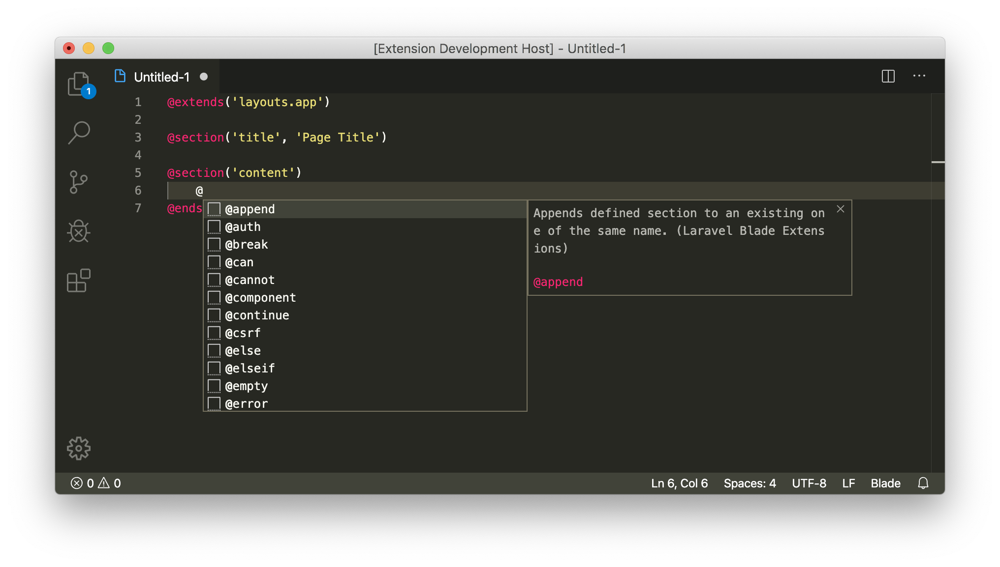

# Laravel Blade

Laravel Blade Snippets, Syntax Highlighting and Formatting for VS Code. 

Converted from [language-blade](https://github.com/jawee/language-blade).

## User Setting

Enable html emmet:

>```json
>"emmet.includeLanguages": {
>   "blade": "html"
>},
>```

## Features
- Syntax highlighter
- Blade snippets
- Blade formatting

## Screenshoot 


## Known Issues

Calling out known issues can help limit users opening duplicate issues against your extension.

## Release Notes

Users appreciate release notes as you update your extension.

### 2.0.1

- Update README.md file

### 2.0.0

- Added blade formatting 
- Change codebase to newest vscode extension template

### 1.0.3

- Added some new directive based on Laravel 6.x

### 1.0.2

- Update README.md
- Compatible with vscode 1.39 and above

### 1.0.0

Initial release
